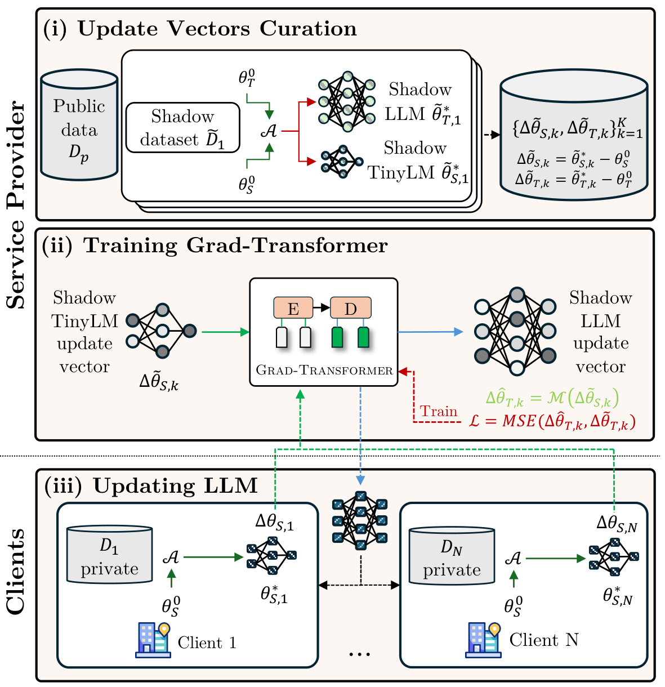

# Gradient Transformer: Learning to Generate Updates for LLMs [Official]
[[Paper](#)] · [[BibTeX](#citation)]

---

Official Implementation for "Gradient Transformer: Learning to Generate Updates for LLMs", published at Forty-Third International Conference on Machine Learning (ICML 2026).

Authors: [Binh-Nguyen Nguyen](https://nguyenrtm.github.io/), [Khang Tran](https://scholar.google.com/citations?user=iCDMKVMAAAAJ&hl=en), [NhatHai Phan](https://sites.google.com/site/ihaiphan/), [Issa Khalil](https://scholar.google.com/citations?user=ESezCmIAAAAJ&hl=en).

---

## Abstract

Many organizations lack computational resources to fine-tune large language models (LLMs) on private (unshareable) data for better utility, while fine-tuning tiny language models (TinyLMs) alone performs poorly. To address this bottleneck, we propose a data-free knowledge distillation framework that generates LLM update vectors based on TinyLMs fine-tuned on private data. 

An update vector is a vector of parameter changes from an initial model to its fine-tuned version on a dataset, capturing the effect of cumulative gradient steps during fine-tuning. The key idea of our framework is a novel ***Gradient Transformer*** that transforms TinyLM's update vectors into LLM's update vectors. As derived from shadow datasets, ***Grad-Transformer*** captures the correlation between TinyLM and LLM update vectors, enabling third-party providers to generate LLM update vectors given the organization's TinyLM update vectors without accessing the organization's private data. 

The framework supports multi-organization collaboration to jointly update LLMs, improving performance and cost-efficiency. Extensive experiments across language modeling and reasoning tasks show that ***Grad-Transformer*** remarkably outperforms state-of-the-art knowledge distillation baselines, even under strict differential privacy protection.

<div align=center>

</div>

---

## Installation

```sh
# Clone the repository
git clone https://github.com/nguyenrtm/grad-transformer.git grad-transformer
cd grad_transformer

# Create and activate the conda environment
conda env create -f env.yml
conda activate grad-transformer
```

---

## Usage

The framework supports two experimental settings: **Single Client** and **Multiple Clients**. Both follow the same three-stage pipeline:

1. Update vector curation
2. Train Grad-Transformer
3. Update the LLM using generated vectors

> **Note:** All scripts below are configured for the **AQuA-RAT** dataset by default. To use a different dataset, update `dataset_path` (and other dataset-related parameters) in the respective scripts.

---

### Single Client setting

**Update Vectors Curation**

We first run the following script to split the original training set to two halves and use one half as public data for training, the other half as private data for client-side fine-tuning, and create the indices for the samples in the shadow datasets.
```sh
bash scripts/gen_idx_single_client.sh
```
We curate the update vectors of the small model and the large model by running the following script.
```sh
bash scripts/gen_gradients_single_client.sh
```
In the script, we collect update vectors from steps between `converged_step` and `num_training_steps` for a model. Before running this, make sure that the model has converged at the configured step `converged_step` when training on the shadow datasets, so that the update vectors are stable. By default, we are using Qwen2.5-3B-Instruct as the small model and Qwen2.5-7B-Instruct as the large model. You can change to any dataset by changing the `dataset_path` parameter.

After this, we convert the gradients into the appropriate format for Grad-Transformer training using the following script.
```sh
bash scripts/convert_gradients.sh
```

**Grad-Transformer Training**

To train Grad-Transformer, please set `small_gradients_paths` and `large_gradients_paths` accordingly, then run the following script.
```sh
bash scripts/grad_transformer.sh
```
Please change the `dataset_size` parameter in the script to the total number of update vectors that you are training the Grad-Transformer on. You can train Grad-Transformer on other datasets by running their respective scripts in the `src/` folder.

> ⚠️ **Important:** The learning rate is sensitive. Too high or too low will prevent convergence of Grad-Transformer and degrade downstream LLM performance. Tune carefully.


**Updating LLM**

First, you train the small model on the private dataset by running the following script.
```sh
bash scripts/finetune.sh
```
Please ensure the `split` parameter in this script is consistent with the `script` hyperparameter defined previously in `scripts/gen_idx_single_client.sh`

Afterwards, you can update the large model using the generated update vectors from Grad-Transformer with the following script.
```sh
bash scripts/updating_llm_single_client.sh
```
Please note that you need to set `input_dim` and `output_dim` in the script to the number of weights in one block of the source model and target model in the Grad-Transformer architecture.

## Multiple Clients setting

**Update Vectors Curation**

We first run the following script to split the original training set to two halves and use one half as public data for training, the other half as private data for client-side fine-tuning. Afterwards, we split the public data to many clients, and create the indices for the samples in the shadow datasets for each client.
```sh
bash scripts/gen_idx_mult_client.sh
```
We curate the update vectors of the small model and the large model by running the following script.
```sh
bash scripts/gen_gradients_mult_client.sh
```
In the script, we collect update vectors from steps between `converged_step` and `num_training_steps` for a model. Before running this, make sure that the model has converged at the configured step `converged_step` when training on the shadow datasets, so that the update vectors are stable. By default, we are using Qwen2.5-3B-Instruct as the small model and Qwen2.5-7B-Instruct as the large model. You can change to any dataset by changing the `dataset_path` parameter.

After this, we convert the gradients into the appropriate format for Grad-Transformer training using the following script.
```sh
bash scripts/convert_gradients.sh
```

**Grad-Transformer Training**

To train Grad-Transformer, please set `small_gradients_paths` and `large_gradients_paths` accordingly, then run the following script.
```sh
bash scripts/grad_transformer.sh
```
Please change the `dataset_size` parameter in the script to the total number of update vectors that you are training the Grad-Transformer on. You can train Grad-Transformer on other datasets by running their respective scripts in the `src/` folder.

> ⚠️ **Important:** The learning rate is sensitive. Too high or too low will prevent convergence of Grad-Transformer and degrade downstream LLM performance. Tune carefully.

**Updating LLM**

First, you train the small model on the private dataset of each client by running the following script.
```sh
bash scripts/distributed_finetune.sh
```

Optionally, you can choose to fine-tune the small model on the private dataset of each client using DP-SGD by running the following script.
```sh
bash scripts/distributed_finetune_dpsgd.sh
```

Afterwards, you can update the large model using the generated update vectors from Grad-Transformer with the following script.
```sh
bash scripts/updating_llm_mult_client.sh
```
Please note that you need to set `input_dim` and `output_dim` in the script to the number of weights in one block of the source model and target model in the Grad-Transformer architecture.

---

## Citation

If you find this work useful, please cite:

```bibtex
@inproceedings{nguyen2026gradient,
  title={Gradient Transformer: Learning to Generate Updates for LLMs},
  author={Nguyen, Binh-Nguyen and Tran, Khang and Phan, NhatHai and Khalil, Issa},
  booktitle={International Conference on Machine Learning},
  year={2026},
  organization={PMLR}
}
```
